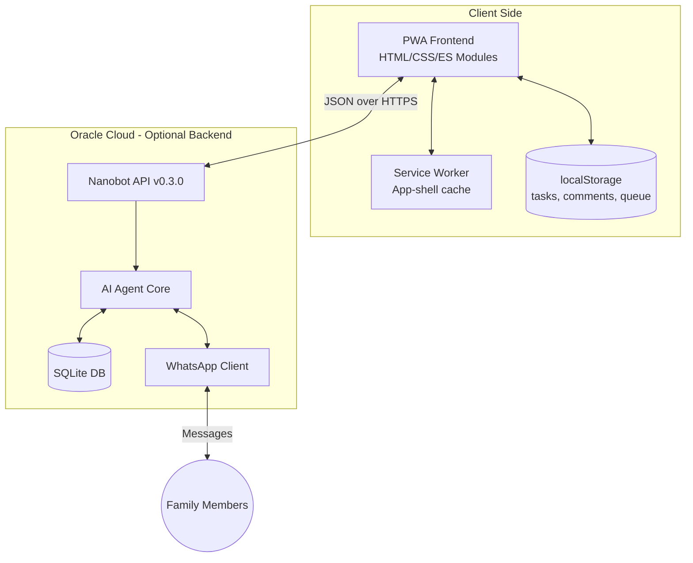
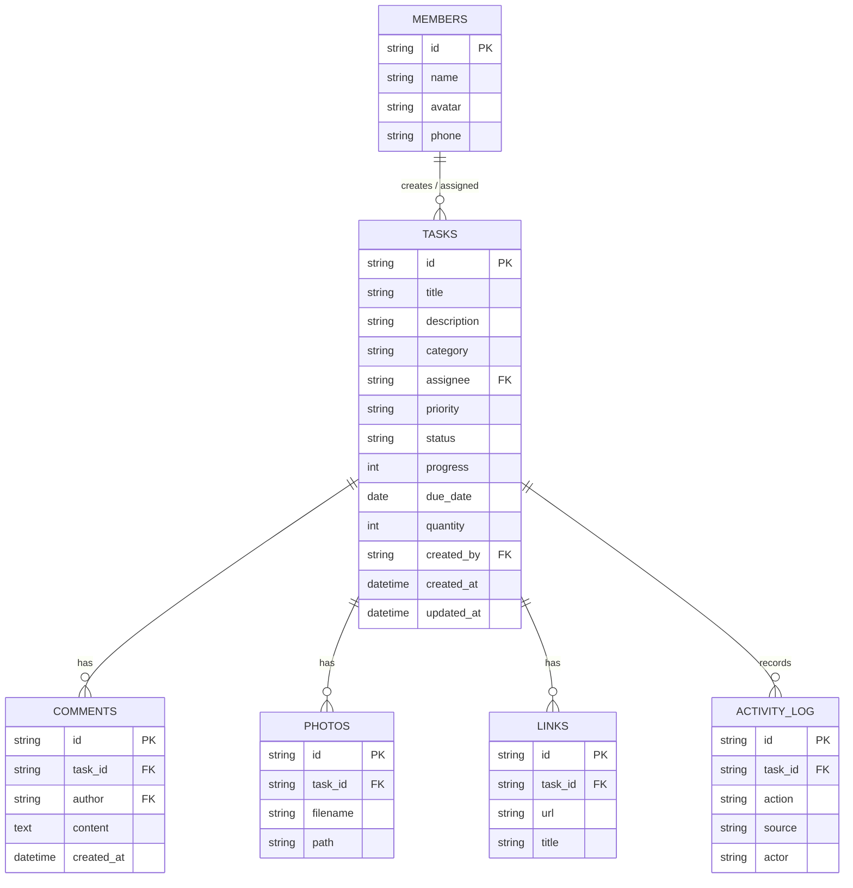

# 🏠 משימות משפחתיות — Family Tasks App

## Overview
**משימות משפחתיות** (Family Tasks) is a Progressive Web App for a couple or family to manage household tasks, shopping lists, and shared projects. The interface is Hebrew and right-to-left throughout.

The app is **local-first**: it is fully functional with no backend at all, storing everything in `localStorage` on the device. When a [nanobot](https://github.com/nanobot-ai/nanobot) backend *is* configured, the app additionally syncs through it and gains WhatsApp integration and AI-assisted features.

## Architecture



The frontend is a vanilla ES-module SPA with hash routing — no framework, no build step.
The backend is optional; every screen degrades to local-only mode when it is absent.

## Tech Stack

| Layer | Technology | Details |
| :--- | :--- | :--- |
| **Frontend** | Vanilla HTML5 / CSS3 / ES2022 modules | No framework, no bundler, CSS custom properties |
| **PWA** | Service Worker, Web App Manifest | Installable, full offline app shell |
| **Backend API** | Nanobot (optional) | v0.3.0 |
| **Database** | SQLite | Server-side only; client uses localStorage |
| **Messaging** | Nanobot WhatsApp integration | Requires Node.js 18+ |
| **Deployment** | Oracle Cloud Infrastructure | Free Tier ARM, Nginx, Certbot |

## Project Structure

```text
Family App/
├── index.html                    # Shell: mounts #app, loads js/app.js as a module
├── manifest.json                 # PWA manifest
├── sw.js                         # Service worker (app-shell cache + update prompt)
├── .gitignore                    # Keeps server/nanobot-config.json out of version control
├── FAMILY_APP.md                 # This document
├── css/
│   └── index.css                 # Entire design system + screen components
├── js/
│   ├── app.js                    # Router, auth gate, service-worker lifecycle, bootstrap
│   ├── api.js                    # Data layer: canonical task shape, storage, sync queue
│   ├── config.js                 # Constants (CONFIG) + user settings (settings)
│   ├── store.js                  # Minimal reactive store
│   ├── utils.js                  # html`` escaping, toasts, dates, storage helpers
│   ├── nanobot.js                # Optional AI-agent helpers
│   ├── components/
│   │   ├── nav.js                # The single bottom navigation
│   │   └── modal.js              # confirm / prompt / photo viewer dialogs
│   └── screens/
│       ├── auth.js               # PIN setup, login, member picker
│       ├── home.js               # Dashboard: stats, categories, activity feed
│       ├── task-list.js          # Filter, search, sort, swipe actions
│       ├── task-detail.js        # Create & edit, comments, links, photos
│       ├── shopping.js           # Quick-entry shopping list
│       └── settings.js           # Profile, members, server, security, data
├── assets/icons/                 # icon-192.png, icon-512.png
└── server/
    ├── setup.sh                  # Oracle Cloud deployment script
    ├── schema.sql                # SQLite schema (source of truth for the data model)
    └── nanobot-config.example.json  # Copy to nanobot-config.json and fill in secrets
```

## Getting Started

### Local Development
No build step is required — serve the directory statically:

```bash
python -m http.server 8080
```

Then open `http://localhost:8080`. On first run the app asks you to set a 4-digit access code.
Without a configured server it runs in local-only mode, which is fully functional.

> **Note:** the service worker caches the app shell aggressively. While developing, either
> unregister it in DevTools → Application → Service Workers, or use a hard reload.

### Server Deployment (Oracle Cloud)
1. SSH into your instance and copy the `server/` directory across.
2. `cp nanobot-config.example.json nanobot-config.json` and fill in your API keys and phone numbers.
3. `sudo chmod +x setup.sh && sudo ./setup.sh your.domain.com`
4. Link WhatsApp by scanning the QR code from the nanobot CLI.
5. Deploy the PWA files to the web root (typically `/var/www/family-app/`).
6. In the app: **הגדרות → שרת**, enter the server URL and API key, then press **בדקו חיבור**.

## Data Model

`server/schema.sql` is the single source of truth. The client uses exactly the same field
names, and `normalizeTask()` in `js/api.js` migrates any older client-side shape into it.



**Enumerations** — `category`: `house`, `shopping`, `general`, `projects`, `events` ·
`priority`: `low`, `medium`, `high`, `urgent` · `status`: `pending`, `in_progress`, `completed`, `overdue`.

`due_date` is a plain local calendar date (`YYYY-MM-DD`), never a timestamp, so a task due
"today" does not shift across timezones. `quantity` backs the shopping-list stepper.

### localStorage keys

| Key | Contents |
| :--- | :--- |
| `family_pin` | `{v, salt, iterations, hash}` — PBKDF2-SHA256 derivation of the access code |
| `family_pin_attempts` | Failed-attempt counter and lockout expiry |
| `family_current_member` | The active member **id** (e.g. `member1`) |
| `family_settings` | Server URL, API key, theme, member names/phones, agent toggles |
| `family_tasks_cache` | All tasks, in canonical shape |
| `family_comments` / `family_links` / `family_photos` / `family_activity` | Task attachments and history |
| `family_offline_queue` | Pending mutations (only populated when a backend is configured) |
| `family_failed_queue` | Mutations retired after repeated sync failures |

`sessionStorage.family_unlocked` gates access for the current app session.

## API Contract

The client posts a JSON instruction and requires a JSON object back — no prose, no markdown
fences. The system message sent with every request states this, and the example agent prompt
in `nanobot-config.example.json` matches it.

- **Endpoint:** `POST {serverUrl}/v1/chat/completions`
- **Auth:** `Authorization: Bearer <API_KEY>`
- **Timeout:** 12 s, then the mutation is queued locally

**Request**
```json
{
  "model": "default",
  "temperature": 0,
  "messages": [
    { "role": "system", "content": "Respond with a single JSON object only..." },
    { "role": "user", "content": "{\"action\":\"create_task\",\"task\":{\"id\":\"...\",\"title\":\"לנקות את המטבח\",\"category\":\"house\",\"priority\":\"high\",\"assignee\":\"member1\"}}" }
  ],
  "session_id": "family-app:member1"
}
```

**Expected response content** (the assistant message body)
```json
{ "success": true, "data": { "task": { "id": "...", "title": "לנקות את המטבח" } } }
```

Supported actions: `ping`, `get_tasks`, `get_task`, `create_task`, `update_task`,
`delete_task`, `add_comment`, `send_whatsapp`.

## Features

1. **Task management** across five categories, with priority, status, progress, due date, and a single assignee.
2. **Rich tasks** — comments, photo attachments (downscaled to 1280 px before storage), and links.
3. **Shopping list** — quick entry, quantity stepper, re-adding an item bumps its quantity, one-tap WhatsApp export.
4. **Progress tracking** — per-task progress bar; reaching 100 % marks the task complete and vice versa.
5. **Undoable deletes** — every delete surfaces a toast with a **בטל** action that restores the task and its attachments.
6. **WhatsApp integration** (requires backend) — reminders, daily summaries, sharing.
7. **Offline support** — full app shell cached; mutations queue and replay when a configured server returns.
8. **PWA install** — installable with a maskable icon set and safe-area-aware layout.

## Design System

All styling lives in `css/index.css`. Screens use its classes rather than inline styles.

Colors are CSS custom properties on `:root`, overridden in three places: a
`@media (prefers-color-scheme: dark)` block for the automatic theme, and explicit
`[data-theme='dark']` / `[data-theme='light']` blocks so a manual choice in Settings
wins over the OS preference.

```css
:root {
  --bg-primary: #FFF8F5;    --bg-card: #FFFFFF;      --bg-elevated: #FFF0EB;
  --accent-primary: #E8837C; /* coral — primary CTA */
  --accent-secondary: #9B8EC4; /* lavender */
  --accent-success: #7BC4A0;  --accent-warning: #F5C26B;  --accent-danger: #E57373;
  --text-primary: #2D2438;  --text-secondary: #8A7D96;  --text-tertiary: #B8ACBF;
  --border: #F0E4EC;        --border-strong: #E0D0DC;
  /* plus --radius-*, --space-*, --fs-*, --shadow-*, --transition-* scales */
}
```

Per-category and per-priority colors are class-driven (`.cat-house`, `.prio-urgent`, …),
each setting a `--cat-color` / `--prio-color` variable. Dark mode lifts the amber, green,
and blue hues for contrast. Layout uses logical properties (`inset-inline-*`,
`border-inline-start`) so RTL is handled without mirrored stylesheets.

## Security

- **Access code** — 4 digits, stretched with PBKDF2-SHA256 (150,000 iterations) over a random
  per-install salt. A bare digest would be brute-forced instantly across only 10,000 candidates.
  Codes stored by earlier versions are re-derived automatically on the next successful login.
- **Lockout** — five wrong attempts trigger a timed lockout that lengthens with each further block.
- **Session gate** — the code is required each time the app is launched, tracked in `sessionStorage`.
  Setting a localStorage key is no longer sufficient to get in.
- **Output escaping** — every screen renders through the `html`` ` tagged template in `js/utils.js`,
  which escapes all interpolated values. Markup is only emitted via the explicit `raw()` marker.
  Link URLs pass through `safeUrl()`, which permits only `http`, `https`, `mailto`, and `tel`.
- **Transport** — HTTPS via Let's Encrypt.

> ⚠️ **Known limitation.** The API key is stored on the device and sent from the browser, so
> anyone with the device can read it. The backend is also an LLM with database access, which
> means a sufficiently crafted instruction (including one arriving over WhatsApp) can influence
> what it does. Treat the server as trusted-network-only: bind nanobot to `127.0.0.1`, put Nginx
> in front of it, and restrict `channels.whatsapp.allowFrom` to known numbers. A thin REST shim
> that performs the CRUD directly — leaving the model only the natural-language parsing — would
> remove this class of risk entirely.

## Offline Behaviour

1. **Service worker** (`sw.js`, cache `family-app-shell-v2`) precaches the whole shell —
   every module, the stylesheet, the manifest, and the icons — each added individually so one
   missing file cannot void the precache. Non-GET requests bypass the cache entirely, because
   the Cache API rejects them.
2. **Updates** — when a new worker installs, the app shows a "גרסה חדשה זמינה" toast with a
   refresh action rather than silently serving stale code.
3. **Local data** is the immediate source of truth for every read and write.
4. **Mutation queue** — populated *only* when a server is configured but unreachable. Repeated
   edits to one task collapse into a single entry, and an item that keeps failing is retired to
   `family_failed_queue` after five attempts so it cannot block everything behind it.

## Nanobot Agent Behaviour

- **System prompt** — instructs the agent to return strict JSON, lists the supported actions,
  and documents the exact `tasks` columns. See `server/nanobot-config.example.json`.
- **WhatsApp messages** are formatted in Hebrew with emojis, e.g.
  `✅ אמיר סיים/ה את המשימה: קניות בסופר.`
- **Helpers** in `js/nanobot.js` (`generateDailySummary`, `inferProgress`, `suggestUpdates`,
  `markOverdueTasks`) all fall back to a sensible local result when the agent is unavailable.

## Hebrew String Reference

| Context | Hebrew |
| :--- | :--- |
| Navigation | בית · משימות · קניות · הגדרות |
| Statuses | ממתין · בתהליך · הושלם · באיחור |
| Priorities | נמוכה · בינונית · גבוהה · דחוף |
| Save / Cancel / Delete | שמור · ביטול · מחק |
| Undo | בטל |
| Empty task list | אין משימות כרגע. איזה כיף! 🎉 |
| Local-only mode | מצב מקומי — אין סנכרון |

## Future Roadmap

- 🔔 **Push notifications** via the Web Push API.
- 🔄 **Recurring tasks** for daily, weekly, or monthly chores.
- 📆 **Shared calendar view** for `events` and `projects`.
- 🎙️ **Voice input** — Hebrew speech-to-text for hands-free entry.
- 👨‍👩‍👧‍👦 **Multi-family support** via workspace / tenant ids.
- 🗄️ **IndexedDB for photos** — localStorage caps out around 5 MB, so photo-heavy use will
  eventually need a larger store. Images are downscaled and quota errors are reported today,
  but the ceiling remains.
- 🔐 **Server-side credential handling** — a token-per-device proxy so the API key never
  reaches the browser.

## Troubleshooting

- **Changes don't appear after deploying** — the service worker is serving the cached shell.
  Bump `VERSION` in `sw.js`; users then get the update toast on their next visit.
- **"מצב מקומי" won't go away** — the server URL in Settings is empty or not a valid
  `http(s)` URL. Press **בדקו חיבור** for the specific failure reason.
- **Tasks not syncing** — check the browser console for CORS errors and confirm the agent
  returns a bare JSON object; prose replies are rejected as `unparseable-response`.
- **WhatsApp linking fails** — restart nanobot, delete `.wwebjs_auth/`, rescan within 30 s.
- **Oracle instance OOM** — use an Ampere A1 instance, or add swap:
  `sudo fallocate -l 2G /swapfile && sudo mkswap /swapfile && sudo swapon /swapfile`.
- **Forgot the access code** — the login screen offers a reset, which clears all local data
  on that device. There is no recovery that preserves it, by design.
